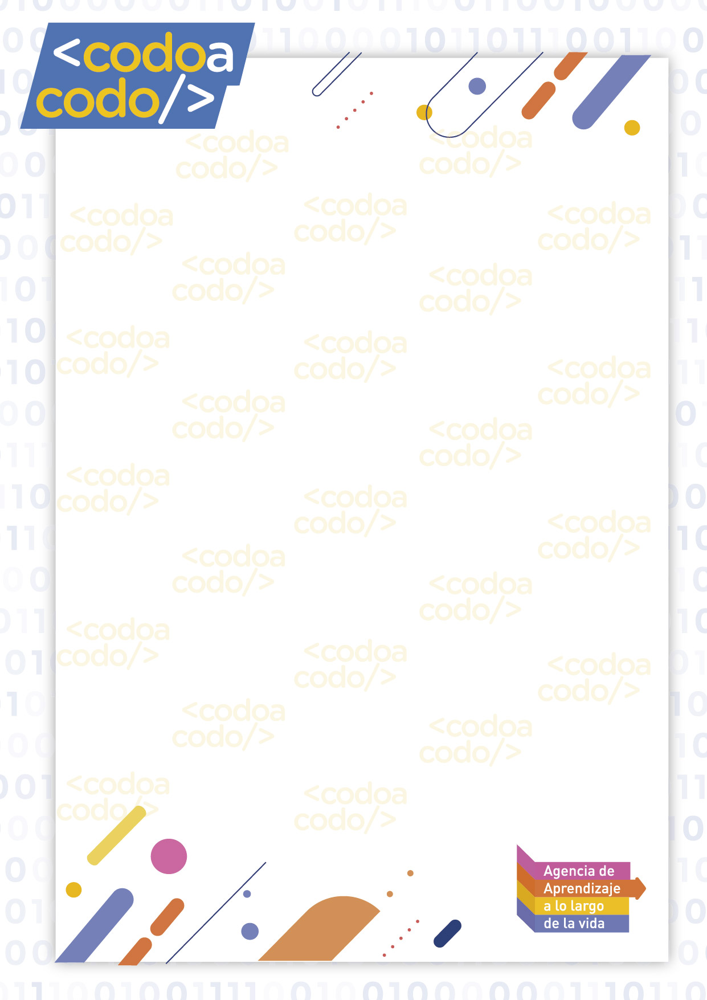

[guias pdf](guias.pdf)

```python
# Ejemplo de código Python
def saludar(nombre):
    print(f"Hola, {nombre}!")

saludar("Juan")
```



# Guia de ejercicios
## codo a codo inicial

### Guia 0
### Primeros pasos
0.1 Permitir que el usuario ingrese un nombre y mostrar un saludo usando ese nombre. 
* Entrada: “Antonio” Salida: “Hola Antonio”
0.2 Permitir que el usuario ingrese dos números y mostrar el resultado de la suma
	* Entrada: 5, 8 Salida: 13
0.3 Permitir que el usuario ingrese
